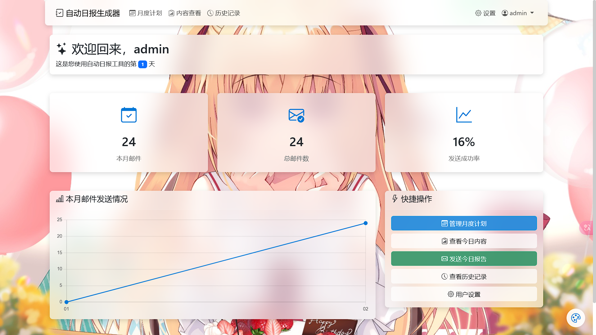

# 自动日报生成器

一个基于Web的自动报告工具，用于自动生成和发送日报。



## 特点

- **多用户支持**：每个用户拥有独立的账户和设置
- **内容管理**：通过Web界面管理月度工作计划
- **自动提取**：根据日期自动提取当日工作内容
- **AI增强**：使用Gemini AI优化内容表述
- **邮件发送**：自动生成并发送格式化邮件
- **任务调度**：可配置的定时任务，按用户设置的时间自动发送
- **历史记录**：查看已发送邮件的历史记录和状态
- **亚克力UI**：现代化、美观的用户界面，支持自定义背景和透明度调节

## 技术栈

- **后端**: Django 5.0+
- **前端**: Bootstrap 5 + 少量JavaScript
- **数据库**: SQLite (轻量级，适合个人使用)
- **AI服务**: Gemini API
- **部署**: Gunicorn + Nginx
- **监控**: 内置邮件状态统计

## 系统要求

- Python 3.10+
- 内存: 1GB以上 (1C1G服务器即可运行)
- 存储: 500MB以上可用空间
- 网络: 需要连接互联网访问Gemini API

## 安装和部署

1. 克隆仓库（指定使用django分支）
```bash
git clone -b django https://github.com/zhaojinyang117/auto_daily_report.git
cd auto_daily_report
```

# 或者如果已经克隆了仓库，可以切换到django分支
```bash
git checkout django
```

2. 创建并激活虚拟环境
```bash
python -m venv .venv
source .venv/bin/activate  # Linux/Mac
# 或
.venv\Scripts\activate  # Windows
```

3. 安装依赖
```bash
# 使用pip安装
pip install -e .

# 或者使用更快的包管理器uv
uv sync
```

4. 配置环境变量
复制`.env.example`并重命名为`.env`，设置您的邮箱、API密钥等信息

5. 初始化数据库
```bash
python manage.py migrate
```

6. 创建超级用户
```bash
python manage.py createsuperuser
```

7. 运行开发服务器
```bash
python manage.py runserver
```

8. 访问网站
浏览器访问 http://127.0.0.1:8000

## 生产环境部署

请参考[部署文档](docs/deployment.md)了解如何在生产环境中部署。

## 功能展示

- **统计仪表盘**: 实时展示发送统计和成功率
- **月度计划管理**: 便捷的计划编辑和日期提取
- **背景自定义**: 支持上传自定义背景图片
- **透明度调节**: 可调节UI组件的透明度和模糊效果
- **响应式设计**: 完美适配桌面和移动设备

## 贡献指南

欢迎提交issue和PR来改进项目。请确保您的代码遵循项目的编码规范。

## 许可证

[MIT License](LICENSE)
